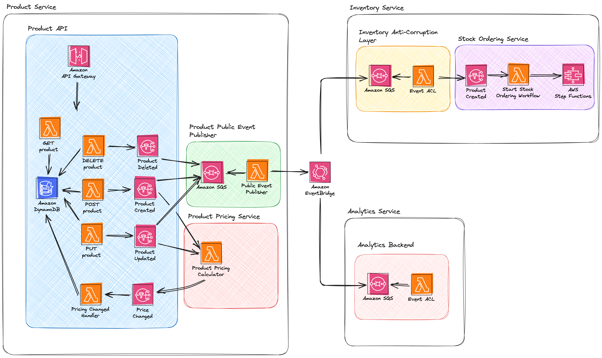
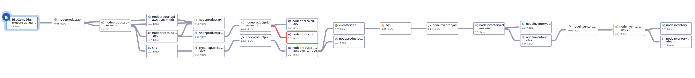

# Serverless Getting Started

> [!CAUTION]
> Deploying resources in this repository may incur costs in your AWS or DataDog account. Each runtime specific README contains instructions on deleting all resources, it is recommended you do this when not in use.

This repository contains source code for demonstrating best practices for observing your AWS serverless applications using Datadog.

## High Level Architecture



## Implementations

|                      | Node                                                            | Python | .NET                                                    | Java                                                        | Go                                                        | Rust                                                   |
| -------------------- | --------------------------------------------------------------- | ------ | ------------------------------------------------------- | ----------------------------------------------------------- | --------------------------------------------------------- | ------------------------------------------------------ |
| AWS CDK              | [Y](./src/loyalty-point-service/README.md#aws-cdk)              |        | [Y](./src/order-service/README.md#aws-cdk)              | [Y](./src/inventory-service/README.md#aws-cdk)              | [Y](./src/product-management-service/README.md#aws-cdk)   | [Y](./src/user-management-service/README.md#aws-cdk)   |
| AWS SAM              | [Y](./src/loyalty-point-service/README.md#aws-sam)              |        | [Y](./src/order-service/README.md#aws-sam)              | [Y](./src/inventory-service/README.md#aws-sam)              | [Y](./src/product-management-service/README.md#aws-sam)   | [Y](./src/user-management-service/README.md#aws-sam)   |
| Terraform            | [Y](./src/loyalty-point-service/README.md#terraform)            |        | [Y](./src/order-service/README.md#terraform)            | [Y](./src/inventory-service/README.md#terraform)            | [Y](./src/product-management-service/README.md#terraform) | [Y](./src/user-management-service/README.md#terraform) |
| Serverless Framework | [Y](./src/loyalty-point-service/README.md#serverless-framework) |        | [N](./src/order-service/README.md#serverless-framework) | [Y](./src/inventory-service/README.md#serverless-framework) |                                                           |                                                        |
| SST v2               | [Y](./src/loyalty-point-service/README.md#serverless-stack-sst) |        |                                                         |                                                             |                                                           |                                                        |

## End to End Tracing Output

Once deployed, the system demonstrates the full end to end observability Datadog provides. Including automatic trace propagation through multiple asynchronous message channels, backend services and demonstrates [`SpanLinks`](https://docs.datadoghq.com/tracing/trace_collection/span_links/).



## Demo Application

### Product Management Service

The product service manages the product catalogue, and items that are available to the frontend. It is made up of 3 independent services.

### Inventory Service

**Runtime: Java**

**AWS Services Used: Application Load Balancer, ECS, Fargate, Lambda, SQS, DynamoDB, EventBridge, StepFunctions**

The inventory service manages stock levels, and allows admin users to update the stock of products. It is made up of 3 independent services.

1. The `InventoryAPI` allows all users to retrieve the stock level for a given product, and allows admin users to update the stock level of a given product
2. The `InventoryACL` service is an [anti-corruption layer](https://learn.microsoft.com/en-us/azure/architecture/patterns/anti-corruption-layer) that consumes events published by external services, translates them to internal events and processes them
3. The `InventoryOrderingService` reacts to `NewProductAdded` events and starts the stock ordering workflow

### Order Service

**Runtime: .NET**

**AWS Services Used: Application Load Balancer, ECS, Fargate, Lambda, SQS, DynamoDB, EventBridge, StepFunctions**

The order services allows users to place orders, and traces the flow of an order through the system using a Step Function workflow. It is made up of 2 independent services

1. The `Orders.Api` provides various API endpoints to create, update and manage orders as they flow through the system
2. The `Orders.BackgroundWorkers` service is an [anti-corruption layer](https://learn.microsoft.com/en-us/azure/architecture/patterns/anti-corruption-layer) that consumes events published by external services, translates them to internal events and processes them

### User Management Service

**Runtime: Rust**

**AWS Services Used: API Gateway, Lambda, SQS, DynamoDB, EventBridge**

The user management services manages everything related to user accounts. It allows users to register and login, generating a JWT that is used by other services to authenticate. It also tracks the number of orders a user has placed. It is made up of 2 independent services

1. The `Api` provides various API endpoints to register new users, login and retrieve details about a given user
2. The `BackgroundWorker` service is an [anti-corruption layer](https://learn.microsoft.com/en-us/azure/architecture/patterns/anti-corruption-layer) that consumes events published by external services, translates them to internal events and processes them

### Loyalty Account Service

**Runtime: NodeJS**

**AWS Services Used: API Gateway, Lambda, SQS, DynamoDB, EventBridge**

The loyalty account service tracks the status of a users loyalty account, and manages how many loyalty points a user has. It allows users to retrieve the current state of their loyalty account, and reacts to OrderCompleted events to add additional points to a loyalty account.

1. The `Api` provides various endpoints to get a users loyalty account, as well as an additional endpoint to spend their points
2. The `LoyaltyACL` service is an [anti-corruption layer](https://learn.microsoft.com/en-us/azure/architecture/patterns/anti-corruption-layer) that consumes events published by external services, translates them to internal events and processes them

### Pricing Service

**Runtime: NodeJS**

**AWS Services Used: API Gateway, Lambda, SQS, DynamoDB, EventBridge**

The pricing service generates custom pricing breakdowns that are available to premium users.

1. The `Api` provides a single endpoint to generate pricing for a specific product synchronously
2. The `PricingEventHandlers` service is an [anti-corruption layer](https://learn.microsoft.com/en-us/azure/architecture/patterns/anti-corruption-layer) that consumes Product Created and Updated events, generates pricing, and then publishes a PricingGenerated event back onto the event bus

## Load Tests

The repository also includes load-test configuration using [Artillery](https://www.artillery.io). You can use this to generate load into the product service, and view the downstream data in Datadog.

**NOTE** The load test runs for roughly 3 minutes, and will generate load into both your AWS and Datadog accounts. Use with caution to avoid billing. As an alternative, a [Postman Collection](./serverless-sample-app.postman_collection.json) is available that you can use to run test manually. Or you can use the integration tests documented in the respective languages folder.

To execute the loadtests, first ensure [Artillery is installed](https://www.artillery.io/docs/get-started/get-artillery). You will also need to set the `API_ENDPOINT` environment variable.

```sh
cd loadtest
export API_ENDPOINT=
artillery run loadtest.yml
```
