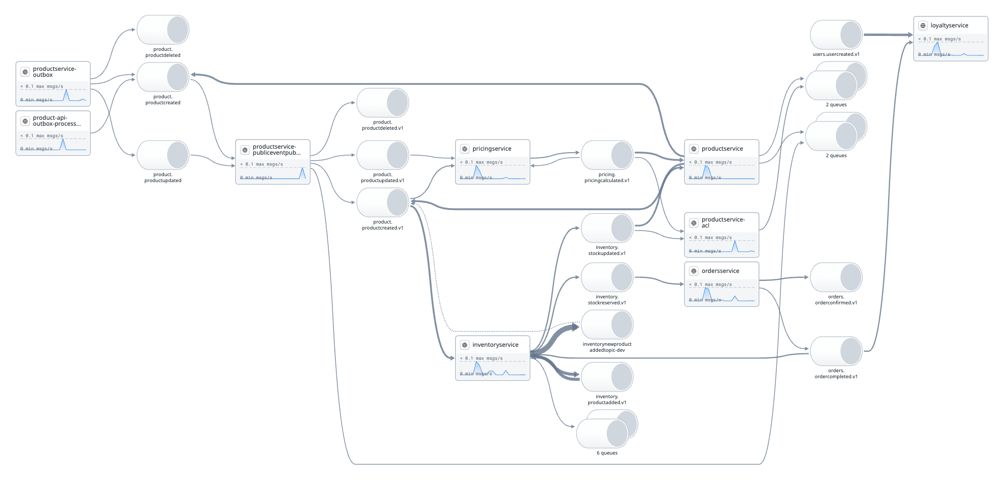

# Serverless Getting Started

> [!CAUTION]
> Deploying resources in this repository may incur costs in your AWS or DataDog account. Each runtime specific README contains instructions on deleting all resources, it is recommended you do this when not in use.

This repository contains source code for demonstrating best practices for observing your AWS serverless applications using Datadog.

## High Level Architecture


## Implementations

|           | Node                                                            | Python                                        | .NET                                         | Java                                             | Go                                                        | Rust                                                   |
| --------- | --------------------------------------------------------------- | --------------------------------------------- | -------------------------------------------- | ------------------------------------------------ | --------------------------------------------------------- | ------------------------------------------------------ |
| AWS CDK   | [Y](./src/loyalty-point-service/README.md#aws-cdk)              | [Y](./src/activity-service/README.md#aws-cdk) | [Y](./src/order-service/README.md#aws-cdk)   | [Y](./src/inventory-service/README.md#aws-cdk)   | [Y](./src/product-management-service/README.md#aws-cdk)   | [Y](./src/user-management-service/README.md#aws-cdk)   |
| AWS SAM   | [Y](./src/loyalty-point-service/README.md#aws-sam)              |                                               | [Y](./src/order-service/README.md#aws-sam)   | [Y](./src/inventory-service/README.md#aws-sam)   | [Y](./src/product-management-service/README.md#aws-sam)   | [Y](./src/user-management-service/README.md#aws-sam)   |
| Terraform | [Y](./src/loyalty-point-service/README.md#terraform)            |                                               | [Y](./src/order-service/README.md#terraform) | [Y](./src/inventory-service/README.md#terraform) | [Y](./src/product-management-service/README.md#terraform) | [Y](./src/user-management-service/README.md#terraform) |
| SST v2    | [Y](./src/loyalty-point-service/README.md#serverless-stack-sst) |                                               |                                              |                                                  |                                                           |                                                        |

## End to End Tracing Output

Once deployed, the system demonstrates the full end to end observability Datadog provides. Including automatic trace propagation through multiple asynchronous message channels, backend services and [`SpanLinks`](https://docs.datadoghq.com/tracing/trace_collection/span_links/).


### Observability for Asynchronous Systems

The sample also demonstrates best practices for observability in event-driven systems, including the [Open Telemetry Semantic Conventions for Messaging Spans](https://opentelemetry.io/docs/specs/semconv/messaging/messaging-spans/) and [Span Links](https://docs.datadoghq.com/tracing/trace_collection/span_links/)

|                                                                                                    | Node                                                                       | Python                                                     | .NET                                                               | Java                                                                   | Go                                                                              | Rust                                                              |
| -------------------------------------------------------------------------------------------------- | -------------------------------------------------------------------------- | ---------------------------------------------------------- | ------------------------------------------------------------------ | ---------------------------------------------------------------------- | ------------------------------------------------------------------------------- | ----------------------------------------------------------------- |
| Span Links                                                                                         | [Y](./src/loyalty-point-service/README.md#span-links)                      | [Y](./src/activity-service/README.md#span-links)           |                                                                    | [Y](./src/inventory-service/README.md#span-links)                      | [Y](./src/product-management-service/README.md#span-links)                      | [Y](./src/user-management-service/README.md#span-links)           |
| [Semantic Conventions](<(https://opentelemetry.io/docs/specs/semconv/messaging/messaging-spans/)>) | [Y](./src/loyalty-point-service/README.md#semantic-conventions)            | [Y](./src/activity-service/README.md#semantic-conventions) | [Y](./src/order-service/README.md#semantic-conventions)            | [Y](./src/inventory-service/README.md#semantic-conventions)            | [Y](./src/product-management-service/README.md#semantic-conventions)            | [Y](./src/user-management-service/README.md#semantic-conventions) |
| [Datadog Data Streams Monitoring](https://docs.datadoghq.com/data_streams/)                        | [Y](./src/loyalty-point-service/README.md#datadog-data-streams-monitoring) |                                                            | [Y](./src/order-service/README.md#datadog-data-streams-monitoring) | [Y](./src/inventory-service/README.md#datadog-data-streams-monitoring) | [Y](./src/product-management-service/README.md#datadog-data-streams-monitoring) |                                                                   |

### Data Streams Monitoring



## Demo Application

### Product Management Service

The product service manages the product catalogue, and items that are available to the frontend. It is made up of 3 independent services.

### Inventory Service

The inventory service manages stock levels, and allows admin users to update the stock of products. It is made up of 3 independent services.

### Order Service

The order services allows users to place orders, and traces the flow of an order through the system using a Step Function workflow. It is made up of 2 independent services

### User Management Service

The user management services manages everything related to user accounts. It allows users to register and login, generating a JWT that is used by other services to authenticate. It also tracks the number of orders a user has placed. It is made up of 2 independent services

### Loyalty Account Service

The loyalty account service tracks the status of a users loyalty account, and manages how many loyalty points a user has. It allows users to retrieve the current state of their loyalty account, and reacts to OrderCompleted events to add additional points to a loyalty account.

### Pricing Service

The pricing service generates custom pricing breakdowns that are available to premium users.

## Deployment

If you wish to deploy the entire application there is a custom Docker image available, based on Ubuntu, with all the required pre-reqs to allow you to deploy the application.

1. Set environment variables
   ```sh
   export AWS_ACCESS_KEY_ID=
   export AWS_SECRET_ACCESS_KEY=
   export AWS_SESSION_TOKEN=
   export AWS_REGION=
   export ENV=
   export DD_API_KEY=
   export DD_SITE=
   ```
2. Navigate to the repository root.
3. Run docker image in interactive mode
   ```sh
   docker run -it \
       -w "/serverless-sample-app" \
       -e AWS_ACCESS_KEY_ID="${AWS_ACCESS_KEY_ID}" \
       -e AWS_SECRET_ACCESS_KEY="${AWS_SECRET_ACCESS_KEY}" \
       -e AWS_SESSION_TOKEN="${AWS_SESSION_TOKEN}" \
       -e AWS_REGION="${AWS_REGION}" \
       -e ENV=${ENV} \
       -e DD_API_KEY="${DD_API_KEY}" \
       -e DD_SITE="${DD_SITE}" \
       public.ecr.aws/k4y9x2e7/dd-serverless-sample-app-build-image:latest
   ```
4. Deploy CDK implementation of app
   ```sh
   cd serverless-sample-app
   git pull
   source ~/.profile
   ./cdk-deploy-all.sh
   ```
5. Once deployment is complete exit the interactive shell by typing `exit`
6. Open your AWS console and check that all CloudFormation stacks deployments are complete

   There should be 7 stacks in total:

   - SharedResourcesStack
   - OrdersService
   - InventoryService
   - UserManagementApi
   - ProductService
   - LoyaltyService
   - PricingService

### Delete Resources

Once you are finished testing, run the below commands to delete resources from your AWS account.

1. Run docker image in interactive mode

   ```sh
   docker run -it \
       -v "$(pwd):/serverless-sample-app" \
       -w "/serverless-sample-app" \
       -e AWS_ACCESS_KEY_ID="${AWS_ACCESS_KEY_ID}" \
       -e AWS_SECRET_ACCESS_KEY="${AWS_SECRET_ACCESS_KEY}" \
       -e AWS_SESSION_TOKEN="${AWS_SESSION_TOKEN}" \
       -e AWS_REGION="${AWS_REGION}" \
       -e ENV=${ENV} \
       -e DD_API_KEY="${DD_API_KEY}" \
       -e DD_SITE="${DD_SITE}" \
       public.ecr.aws/k4y9x2e7/dd-serverless-sample-app-build-image:latest
   ```

2. Delete resources
   ```sh
   source ~/.profile
   ./cdk-destroy.sh
   ```

## Frontend

You can run the front-end application from your local machine by running the following commands

1. Generate local config file containining the relevant API endpoints
   ```sh
   cd src/frontend
   npm i
   node generateConfig.mjs
   ```
2. Startup the local front-end application
   ```sh
   npm run start
   ```
3. Navigate to [http://localhost:8080/login](http://localhost:8080/login) to login

On first run, you'll need to Register a new user. When the first user is registered, an admin user is also created. The admin credentials are

U: admin@serverless-sample.com
P: Admin!23

## Load Tests

The repository also includes load-test configuration using [Artillery](https://www.artillery.io). You can use this to generate load into the product service, and view the downstream data in Datadog.

> [!CAUTION]
> Running the load test will generate requests against both your AWS resources and your Datadog account. This may incur costs. Please use with care!

To execute the loadtests, first ensure [Artillery is installed](https://www.artillery.io/docs/get-started/get-artillery).

1. Generate local config file containining the relevant API endpoints
   ```sh
   cd loadtest
   npm i
   eval "$(node generateEnvVars.mjs)"
   ```
2. Startup the local front-end application
   ```sh
   artillery run loadtest.yml
   ```
