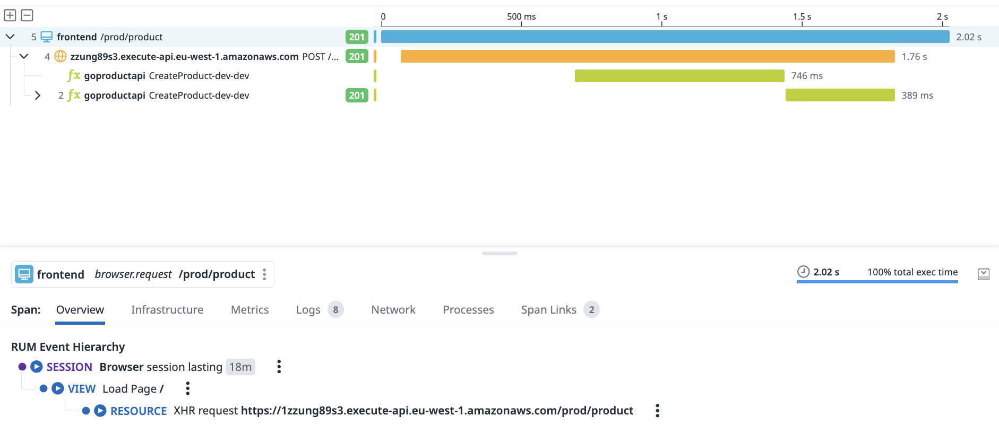

# Product Management Frontend



This frontend example demonstrates how the [Datadog RUM](https://www.datadoghq.com/product/real-user-monitoring/) can integrate with your serverless applications to provide end to end visibility from your front-end applications through to your backend services.

## Prerequisites

- NodeJS
- A [RUM application configured in the Datadog UI](https://docs.datadoghq.com/real_user_monitoring/browser/setup/#setup)
- One of the [backend examples](../../README.md#implementations) deployed to an AWS account. The backend example needs to send telemetry to the same Datadog account as your frontend application

## Run Locally

Once you have a deployed version of the backend application, take a note of the generate API gateway endpoint. You will also need the client token, application id and Datadog site from the Datadog UI.

1. Create a file named `config.js` under the `src` folder
2. Populate the `config.js` file with the below configuration options
```js
export default {
    API_ENDPOINT: '', // The API endpoint of your backend
    DD_CLIENT_TOKEN: '', // The Datadog client token for the RUM application
    DD_APPLICATION_ID: '', // The Datadog application ID from the RUM application
    DD_SITE: '', // The Datadog site to send data to
  };
```
3. Run `npm run start` to start-up a local instance of the front-end application
4. Interact with the UI to generate end to end tracing inside Datadog

