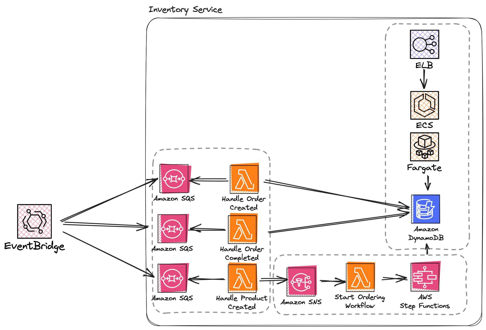

# Inventory Service

**Runtime: Java**

**AWS Services Used: Application Load Balancer, ECS, Fargate, Lambda, SQS, DynamoDB, EventBridge, StepFunctions**



The inventory service manages stock levels, and allows admin users to update the stock of products. It is made up of 3 independent services.

1. The `InventoryAPI` allows all users to retrieve the stock level for a given product, and allows admin users to update the stock level of a given product
2. The `InventoryACL` service is an [anti-corruption layer](https://learn.microsoft.com/en-us/azure/architecture/patterns/anti-corruption-layer) that consumes events published by external services, translates them to internal events and processes them
3. The `InventoryOrderingService` reacts to `NewProductAdded` events and starts the stock ordering workflow

The Java examples use the [Quarkus](https://quarkus.io/) for a high-performance, modern & cloud native Java runtime.

> [!IMPORTANT]  
> The Datadog Lambda extension sends logs directly to Datadog without the need for CloudWatch. The examples in this repository disable Cloudwatch Logs for all Lambda functions.

## Deployment

Ensure you have set the below environment variables before starting deployment:

- `DD_API_KEY`: Your current DD_API_KEY
- `DD_SITE`: The Datadog Site to use
- `AWS_REGION`: The AWS region you want to deploy to
- `ENV`: The environment suffix you want to deploy to, this defaults to `dev`

## AWS CDK

When using Java as your language of choice with the AWS CDK, you need to manually configure the Datadog Lambda Extension and the `dd-trace-java` layer. To simplify this configuration, a custom [`InstrumentFunction`](./cdk/src/main/java/com/cdk/constructs/InstrumentedFunction.java) construct is used to centralise all of the configuration.

```java
List<ILayerVersion> layers = new ArrayList<>(2);
        layers.add(LayerVersion.fromLayerVersionArn(this, "DatadogJavaLayer", String.format("arn:aws:lambda:%s:464622532012:layer:dd-trace-java:21",System.getenv("AWS_REGION"))));
        layers.add(LayerVersion.fromLayerVersionArn(this, "DatadogLambdaExtension", String.format("arn:aws:lambda:%s:464622532012:layer:Datadog-Extension:80", System.getenv("AWS_REGION"))));

var builder = Function.Builder.create(this, props.routingExpression())
    // Remove for brevity
    .layers(layers);
```

The relevant Datadog environment variables are also set.

```java
Map<String, String> lambdaEnvironment = new HashMap<>();
lambdaEnvironment.put("AWS_LAMBDA_EXEC_WRAPPER", "/opt/datadog_wrapper");
lambdaEnvironment.put("DD_SITE", System.getenv("DD_SITE") == null ? "datadoghq.com" : System.getenv("DD_SITE"));
lambdaEnvironment.put("DD_SERVICE", props.sharedProps().service());
lambdaEnvironment.put("DD_ENV", props.sharedProps().env());
lambdaEnvironment.put("DD_VERSION", props.sharedProps().version());
lambdaEnvironment.put("DD_API_KEY_SECRET_ARN", props.sharedProps().ddApiKeySecret().getSecretArn());
lambdaEnvironment.put("DD_CAPTURE_LAMBDA_PAYLOAD", "true");
lambdaEnvironment.put("DD_LOGS_INJECTION", "true");
```

```java
props.sharedProps().ddApiKeySecret().grantRead(this.function);
```

### Deploy

The Datadog extension retrieves your Datadog API key from a Secrets Manager secret, this secret is created as part of the stack deployment.

If you are using secrets manager in production, you should create your secret separately from your application.

To deploy all stacks and resources, run:

```sh
cd cdk
cdk deploy --all --require-approval never
```

Alternatively, if you have `make` installed you can simply run:

``sh
make cdk-deploy
``

### Cleanup

To cleanup resources run

```sh
cdk destroy --all
```

## AWS SAM

The AWS SAM example leverages the Datadog CloudFormation Macro. The macro auto-instruments your Lambda functions at the point of deployment. Ensure you have followed the [installation instructions](https://docs.datadoghq.com/serverless/libraries_integrations/macro/) before continuing with the SAM deployment.

```yaml
Transform:
  - AWS::Serverless-2016-10-31
  - Name: DatadogServerless
    Parameters:
      stackName: !Ref "AWS::StackName"
      apiKey: !Ref DDApiKey
      dotnetLayerVersion: "20"
      extensionLayerVersion: "80"
      service: !Ref ServiceName
      env: !Ref Env
      version: !Ref CommitHash
      site: !Ref DDSite
      captureLambdaPayload: true
```

### Deploy

```sh
sam build
sam deploy --stack-name InventoryService-${ENV} --parameter-overrides ParameterKey=DDApiKey,ParameterValue=${DD_API_KEY} ParameterKey=DDSite,ParameterValue=${DD_SITE} ParameterKey=Env,ParameterValue=${ENV} ParameterKey=CommitHash,ParameterValue=${COMMIT_HASH} --no-confirm-changeset --no-fail-on-empty-changeset --capabilities CAPABILITY_IAM CAPABILITY_AUTO_EXPAND --resolve-s3 --region ${AWS_REGION}
```

Alternatively, you can run

```sh
make sam
```

### Cleanup

Use the below script to cleanup resources deployed with AWS SAM.

```sh
sam delete --stack-name DotnetTracing --region $AWS_REGION --no-prompts
```

## Terraform

Terraform does not natively support compiling Java code. When deploying with Java, you first need to compile your Java code. The JAR file is passed directly to the `filename` property of the `aws_lambda_function` resource. The [`deploy.sh`](./deploy.sh) script performs this action. Running `mvn clean package` and then `terraform apply`.

### Configuration

A custom [`lambda_function`](./infra/modules/lambda-function/main.tf) module is used to group together all the functionality for deploying Lambda functions. This handles the creation of the CloudWatch Log Groups, and default IAM roles.

The [Datadog Lambda Terraform module](https://github.com/DataDog/terraform-aws-lambda-datadog) is used to create and configure the Lambda function with the required extensions, layers and configurations.

> **IMPORTANT!** If you are using AWS Secrets Manager to hold your Datadog API key, ensure your Lambda function has permissions to call the `secretsmanager:GetSecretValue` IAM action.

```terraform
module "aws_lambda_function" {
  source  = "DataDog/lambda-datadog/aws"
  version = "3.0.0"

  s3_bucket = var.s3_bucket_name
  s3_key = aws_s3_object.object.key
  s3_object_version = aws_s3_object.object.version_id
  function_name            = "TF-${var.service_name}-${var.function_name}-${var.env}"
  role                     = aws_iam_role.lambda_function_role.arn
  handler                  = var.lambda_handler
  runtime                  = "java21"
  memory_size              = var.memory_size
  logging_config_log_group = aws_cloudwatch_log_group.lambda_log_group.name
  source_code_hash         = base64sha256(filebase64(var.jar_file))
  timeout                  = var.timeout
  publish                  = var.enable_snap_start
  snap_start_apply_on      = var.enable_snap_start ? "PublishedVersions" : "None"

  environment_variables = merge(tomap({
    "DOMAIN": "inventory"
    "TEAM": "inventory"
    "MAIN_CLASS" : "${var.package_name}.FunctionConfiguration"
    "DD_SITE" : var.dd_site
    "DD_SERVICE" : var.service_name
    "DD_ENV" : var.env
    "ENV" : var.env
    "DD_VERSION" : var.app_version
    "DD_API_KEY_SECRET_ARN" : var.dd_api_key_secret_arn
    "DD_CAPTURE_LAMBDA_PAYLOAD" : "true"
    "DD_SERVERLESS_APPSEC_ENABLED": "true"
    "DD_IAST_ENABLED": "true"
    "DD_LOGS_INJECTION" : "true"
    "spring_cloud_function_definition" : var.routing_expression
    "QUARKUS_LAMBDA_HANDLER": var.routing_expression}),
    var.environment_variables
  )

  datadog_extension_layer_version = 80
  datadog_java_layer_version      = 19
}
```

### Deploy

The root of the repository contains a  Makefile, this will compile all the Java code, generate the ZIP files and run `terraform apply`. To deploy the Terraform example, simply run:

```sh
export TF_STATE_BUCKET_NAME=<THE NAME OF THE S3 BUCKET>
make tf-apply
```

The `make tf-apply` command will compile and package your Lambda functions one by one, and then run `terraform apply --var-file dev.tfvars`.

The example expects an S3 backend to use as your state store. Alternatively, comment out the S3 backend section in [`providers.tf'](./infra/providers.tf).

```tf
terraform {
  required_providers {
    aws = {
      source  = "hashicorp/aws"
      version = "~> 5.61"
    }
  }
#  backend "s3" {}
}

provider "aws" {
  region = var.region
}
```

And re-run the apply command.

```
make tf-apply-local
```

### Cleanup

To clean-up all Terraform resources run:

```sh
make tf-destroy
```

## Serverless Framework

The Serverless Framework is not supporting future runtimes in V3. Due to the changes in licensing for the serverless framework in V4 onwards, this repo **does not** include examples for V4.

See this [GitHub issue for further comments](https://github.com/serverless/serverless/issues/12367).