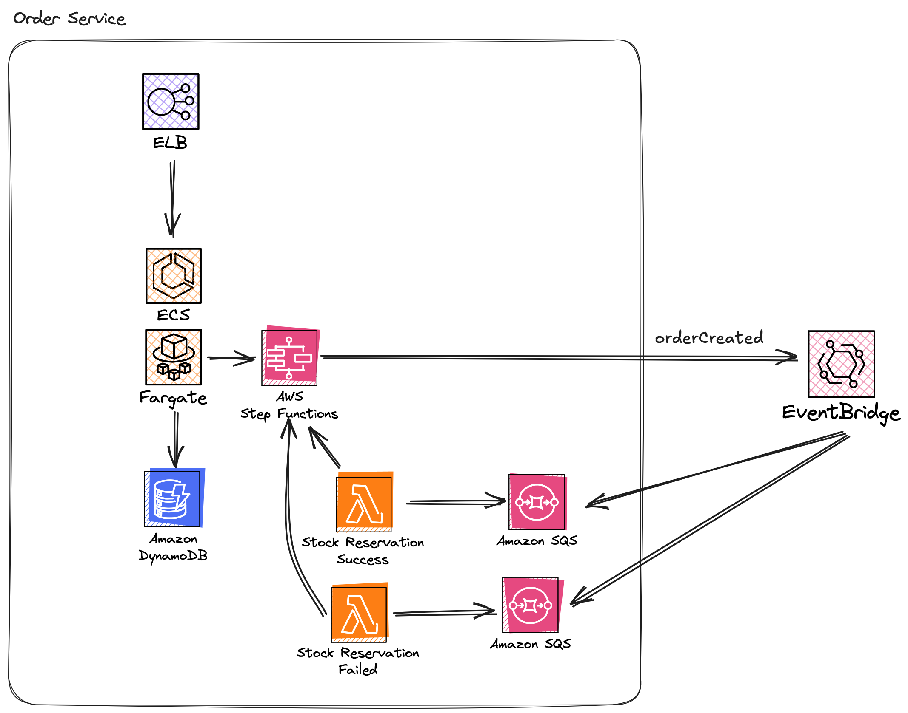

# Order Service

**Runtime: .NET**

**AWS Services Used: Application Load Balancer, ECS, Fargate, Lambda, SQS, DynamoDB, EventBridge, StepFunctions**



The order services allows users to place orders, and traces the flow of an order through the system using a Step Function workflow. It is made up of 2 independent services

1. The `Orders.Api` provides various API endpoints to create, update and manage orders as they flow through the system
2. The `Orders.BackgroundWorkers` service is an [anti-corruption layer](https://learn.microsoft.com/en-us/azure/architecture/patterns/anti-corruption-layer) that consumes events published by external services, translates them to internal events and processes them

The .NET sample code uses the [Lambda Annotations Framework](https://github.com/aws/aws-lambda-dotnet/blob/master/Libraries/src/Amazon.Lambda.Annotations/README.md) to simplify how you define Lambda functions.

> [!IMPORTANT]  
> The Datadog Lambda extension sends logs directly to Datadog without the need for CloudWatch. The examples in this repository disable Cloudwatch Logs for all Lambda functions.

## Deployment

Ensure you have set the below environment variables before starting deployment:

- `DD_API_KEY`: Your current DD_API_KEY
- `DD_SITE`: The Datadog Site to use
- `AWS_REGION`: The AWS region you want to deploy to
- `ENV`: The environment suffix you want to deploy to, this defaults to `dev`

## AWS CDK

When using .NET as your language of choice with the AWS CDK, you can use the `Amazon.CDK.AWS.Lambda.DotNet` Nuget package to compile your Lambda Functions. This Nuget package provides a `DotNetFunction` class that handles the compilation of your .NET code.

You also need to add the Datadog Lambda layers, one for the .NET tracer and one for the Datadog Lambda Extension.

```c#
Layers =
[
    LayerVersion.FromLayerVersionArn(this, "DDExtension", $"arn:aws:lambda:{Environment.GetEnvironmentVariable("AWS_REGION") ?? "us-east-1"}:464622532012:layer:Datadog-Extension-ARM:77"),
    LayerVersion.FromLayerVersionArn(this, "DDTrace", $"arn:aws:lambda:{Environment.GetEnvironmentVariable("AWS_REGION") ?? "us-east-1"}:464622532012:layer:dd-trace-dotnet-ARM:20"),
],
```

The relevant Datadog environment variables are also set.

```c#
var defaultEnvironmentVariables = new Dictionary<string, string>()
{
    { "POWERTOOLS_SERVICE_NAME", props.Shared.ServiceName },
    { "POWERTOOLS_LOG_LEVEL", "DEBUG" },
    { "AWS_LAMBDA_EXEC_WRAPPER", "/opt/datadog_wrapper" },
    { "DD_SITE", System.Environment.GetEnvironmentVariable("DD_SITE") },
    { "DD_ENV", props.Shared.Env },
    { "ENV", props.Shared.Env },
    { "DD_VERSION", props.Shared.Version },
    { "DD_SERVICE", props.Shared.ServiceName },
    { "DD_API_KEY_SECRET_ARN", props.DdApiKeySecret.SecretArn },
    { "DD_CAPTURE_LAMBDA_PAYLOAD", "true" },
};
```

This CDK implementation uses a [custom `InstrumentedFunction` L3 construct](./cdk/Constructs/InstrumentedFunction.cs) to ensure all Lambda functions are instrumented correctly and consistently. This also removes the ability for the Lambda function to send logs to CloudWatch using a custom IAM policy. Logs are shipped using the Datadog extension, and aren't required to log to CloudWatch.

### Deploy

The Datadog extension retrieves your Datadog API key from a Secrets Manager secret, this secret is created as part of the stack deployment.

If you are using secrets manager in production, you should create your secret separately from your application.

To deploy all stacks and resources, run:

```sh
cd cdk
cdk deploy --all --require-approval never
```

Alternatively, if you have `make` installed you can simply run:

``sh
make cdk-deploy
``

### Cleanup

To cleanup resources run

```sh
cdk destroy --all
```

## AWS SAM

The AWS SAM example leverages the Datadog CloudFormation Macro. The macro auto-instruments your Lambda functions at the point of deployment. Ensure you have followed the [installation instructions](https://docs.datadoghq.com/serverless/libraries_integrations/macro/) before continuing with the SAM deployment.

```yaml
Transform:
  - AWS::Serverless-2016-10-31
  - Name: DatadogServerless
    Parameters:
      stackName: !Ref "AWS::StackName"
      apiKey: !Ref DDApiKey
      dotnetLayerVersion: "20"
      extensionLayerVersion: "77"
      service: !Ref ServiceName
      env: !Ref Env
      version: !Ref CommitHash
      site: !Ref DDSite
      captureLambdaPayload: true
```

### Deploy

```sh
sam build
sam deploy --stack-name OrdersService-${ENV} --parameter-overrides ParameterKey=DDApiKey,ParameterValue=${DD_API_KEY} ParameterKey=DDSite,ParameterValue=${DD_SITE} ParameterKey=Env,ParameterValue=${ENV} ParameterKey=CommitHash,ParameterValue=${COMMIT_HASH} --no-confirm-changeset --no-fail-on-empty-changeset --capabilities CAPABILITY_IAM CAPABILITY_AUTO_EXPAND --resolve-s3 --region ${AWS_REGION}
```

Alternatively, you can run

```sh
make sam
```

### Cleanup

Use the below script to cleanup resources deployed with AWS SAM.

```sh
sam delete --stack-name DotnetTracing --region $AWS_REGION --no-prompts
```

## Terraform

Terraform does not natively support compiling .NET code. When deploying with Terraform, you first need to compile your .NET code. The publish directory is passed to the Lambda function resource as a .ZIP file. A [`make`](https://formulae.brew.sh/formula/make) command is used to test, package and deploy .NET code with terraform.

### Configuration

A custom [`lambda_function`](./infra/modules/lambda-function/main.tf) module is used to group together all the functionality for deploying Lambda functions. This handles the creation of the CloudWatch Log Groups, and default IAM roles.

The [Datadog Lambda Terraform module](https://github.com/DataDog/terraform-aws-lambda-datadog) is used to create and configure the Lambda function with the required extensions, layers and configurations.

> **IMPORTANT!** If you are using AWS Secrets Manager to hold your Datadog API key, ensure your Lambda function has permissions to call the `secretsmanager:GetSecretValue` IAM action.

```terraform
module "aws_lambda_function" {
  source  = "DataDog/lambda-datadog/aws"
  version = "3.0.0"

  filename                 = var.publish_directory
  function_name            = "TfDotnet-${var.function_name}-${var.env}"
  role                     = aws_iam_role.lambda_function_role.arn
  handler                  = var.lambda_handler
  runtime                  = "dotnet8"
  memory_size              = var.memory_size
  logging_config_log_group = aws_cloudwatch_log_group.lambda_log_group.name
  source_code_hash         = base64sha256(filebase64(var.publish_directory))
  timeout                  = var.timeout

  environment_variables = merge(tomap({
    "TEAM": "orders",
    "DOMAIN" : "orders",
    "ENV": var.env,
    "DD_SITE" : var.dd_site
    "DD_SERVICE" : var.service_name
    "DD_ENV" : var.env
    "DD_VERSION" : var.app_version
    "DD_API_KEY_SECRET_ARN" : var.dd_api_key_secret_arn
    "DD_CAPTURE_LAMBDA_PAYLOAD": "true"
    "AWS_LAMBDA_EXEC_WRAPPER": "/opt/datadog_wrapper"
    "DD_LOGS_INJECTION": "true"
    "POWERTOOLS_SERVICE_NAME": var.service_name
    "POWERTOOLS_LOG_LEVEL": "DEBUG"}),
    var.environment_variables
  )

  datadog_extension_layer_version = 77
  datadog_dotnet_layer_version      = 20
}
```

### Deploy
The root of the repository contains a  Makefile, this will compile all .NET code, generate the ZIP files and run `terraform apply`. To deploy the Terraform example, simply run:

```sh
export TF_STATE_BUCKET_NAME=<THE NAME OF THE S3 BUCKET>
make tf-apply
```

The `make tf-apply` command will compile and package your Lambda functions one by one, and then run `terraform apply --var-file dev.tfvars`.

The example expects an S3 backend to use as your state store. Alternatively, comment out the S3 backend section in [`providers.tf'](./infra/providers.tf).

```tf
terraform {
  required_providers {
    aws = {
      source  = "hashicorp/aws"
      version = "~> 5.61"
    }
  }
#  backend "s3" {}
}

provider "aws" {
  region = var.region
}
```

And re-run the apply command.

```
make tf-apply-local
```

### Cleanup

To clean-up all Terraform resources run:

```sh
make tf-destroy
```

## Serverless Framework

The Serverless Framework has not added support for .NET 8 in serverless framework V3. Due to the changes in licensing for the serverless framework in V4 onwards, this repo **does not** include examples for V4, and therefore does not include examples for .NET 8 and serverless framework.

See this [GitHub issue for further comments](https://github.com/serverless/serverless/issues/12367).

## Testing

After deployment, you can run a set of integration tests against the running application. You can use the tests to visualise how Datadog observability works for your serverless .NET applications.

To run the tests, either run:

```sh
cd src/Orders.IntegrationTests;dotnet test
```

Or if you have `make` installed

```sh
make integration-test
```