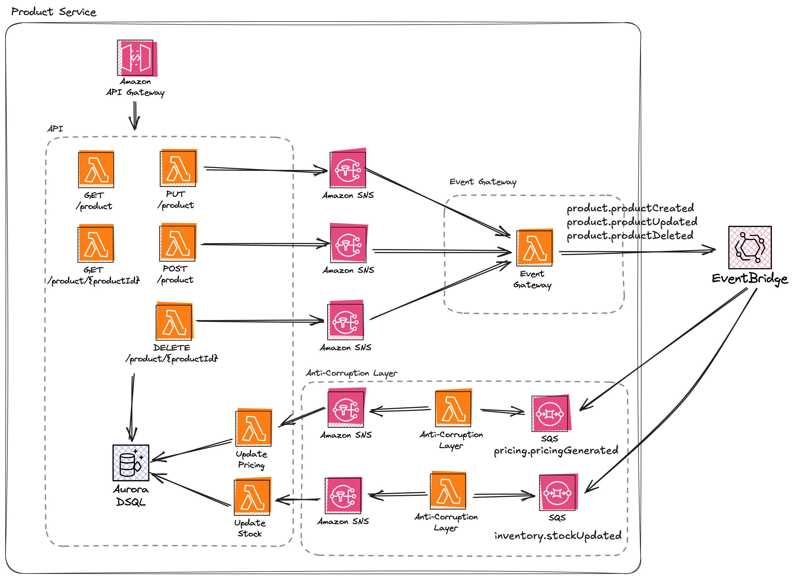

# Product Management Service

**Runtime: GoLang**

**AWS Services Used: API Gateway, Lambda, Aurora DSQL, SNS, SQS, EventBridge**



The product service manages the product catalogue, and items that are available to the frontend. It is made up of 3 independent services.

1. The `ProductAPI` provides CRUD (Create, Read, Update, Delete) API provides the ability to manage product information. On all CRUD requests, private events are published onto internal SNS topics for downstream processing. The API has one additional Lambda function reacting to `PricingChanged` events published by the `PricingService`.
2. The `ProductAcl` service is an [anti-corruption layer](https://learn.microsoft.com/en-us/azure/architecture/patterns/anti-corruption-layer) that consumes events published by external services, translates them to internal events and processes them
3. The `ProductEventPublisher` acts as a translation layer between private and public events. It takes the `ProductCreated`, `ProductUpdated` and `ProductDeleted` events and translates them into the respective events for downstream processing.

This README contains relevant instructions for deploying this individual service with each of the available IaC tools. As well as details on any Go specific implementation details when instrumenting with Datadog.

```go
span := tracer.StartSpanWithContext(ctx, "process.message")
defer span.Finish()
```

> [!IMPORTANT]  
> The Datadog Lambda extension sends logs directly to Datadog without the need for CloudWatch. The examples in this repository disable Cloudwatch Logs for all Lambda functions. 

## Deployment

Ensure you have set the below environment variables before starting deployment:

- `DD_API_KEY`: Your current DD_API_KEY
- `DD_SITE`: The Datadog Site to use
- `AWS_REGION`: The AWS region you want to deploy to
- `ENV`: The environment suffix you want to deploy to, this defaults to `dev`

## Observability for Asynchronous Systems

### Span Links

The default behavious of the Datadog tracer when working with serverless is to automatically create parent-child relationships. For example, if you consume a message from Amazon SNS and that message contains the `_datadog` trace context, the context is automatically extracted and your Lambda handler is set as a child of the upstream call.

This is useful in some cases, but can cause more confusion by creating traces that are extremely long, or have hundreds of spans underneath them. [Span Links](https://docs.datadoghq.com/tracing/trace_collection/span_links/) are an alternative approach that link together causally related spans, that you don't neccessarily want to include as a parent-child relationship. This can be useful when events are crossing service boundaries, or if you're processing a batch of messages.

To configure Span Links, you can see an example in the [`main.go` handler on line 93](./src/product-acl/inventory-stock-updated-event-handler/main.go#93). The trace and span ID's are parsed from the inbound event, and then used to create a link to the upstream context.

```go
var spanLinks []ddtrace.SpanLink

if evt.TraceParent != "" {
  // Split the traceparent header to extract trace ID and span ID. The traceparent should be a valid W3C trace context.
  parts := strings.Split(evt.TraceParent, "-")

  if len(parts) == 4 {
    traceId, err := strconv.ParseUint(parts[1], 16, 64)
    if err == nil {
      spanId, err := strconv.ParseUint(parts[2], 16, 64)
      if err == nil {
        spanLinks = append(spanLinks, ddtrace.SpanLink{
          TraceID: traceId,
          SpanID:  spanId,
        })
      }
    }
  }
}

processSpan, _ := tracer.StartSpanFromContext(ctx, fmt.Sprintf("process %s", evt.Type), tracer.WithSpanLinks(spanLinks), tracer.ChildOf(span.Context()))
```

For this to work, you must also set the below three environment variables on your Lambda function to disable automatic propagation.

```py
'DD_TRACE_PROPAGATION_BEHAVIOR_EXTRACT': "none",
# This flag disables automatic propagation of traces from incoming events.
'DD_TRACE_PROPAGATION_STYLE_EXTRACT': 'false',
```

### Semantic Conventions

The [Open Telemetry Semantic Conventions for Messaging Spans](https://opentelemetry.io/docs/specs/semconv/messaging/messaging-spans/) define a set of best practices that all spans related to messaging should follow.

You can see examples of this in [`main.go` handler on line 116](./src/product-acl/inventory-stock-updated-event-handler/main.go#116) for starting a span and [here for adding the default attributes](./src/product-acl/inventory-stock-updated-event-handler/main.go#119).

### Datadog Data Streams Monitoring

The service also demonstrates the use of [Datadog Data Streams Monitoring (DSM)](https://docs.datadoghq.com/data_streams/). DSM doesn't support all messaging transports automatically, so manual checkpoint is used to record both the *in* and *out* message channels. An example can be found in [the `main.go`](./src/product-acl/inventory-stock-updated-event-handler/main.go#113).

```go
_, _ = tracer.SetDataStreamsCheckpointWithParams(datastreams.ExtractFromBase64Carrier(context.Background(), evt), options.CheckpointParams{ServiceOverride: "productservice-acl",}, "direction:in", "type:sns", "topic:"+evt.Type, "manual_checkpoint:true")
```

## AWS CDK

The [Datadog CDK Construct](https://docs.datadoghq.com/serverless/libraries_integrations/cdk/) simplifies the setup when instrumenting with Datadog. To get started:

```sh
go get github.com/DataDog/datadog-cdk-constructs-go/ddcdkconstruct
```

Once installed, you can use the Construct to configure all of your Datadog settings. And then use the `AddLambdaFunctions` function to instrument your Lambda functions.

```go
datadog := ddcdkconstruct.NewDatadog(
    stack,
    jsii.String("Datadog"),
    &ddcdkconstruct.DatadogProps{
    ExtensionLayerVersion:  jsii.Number(83),
    AddLayers:              jsii.Bool(true),
    Site:                   jsii.String(os.Getenv("DD_SITE")),
    ApiKeySecret:           ddApiKeySecret,
    Service:                &serviceName,
    Env:                    &env,
    Version:                &version,
    EnableColdStartTracing: jsii.Bool(true),
    CaptureLambdaPayload:   jsii.Bool(true),
    EnableDatadogTracing:   jsii.Bool(true),
})

datadog.AddLambdaFunctions(&[]interface{}{function.Function}, nil)
```

This CDK implementation uses a [custom `InstrumentedFunction` L3 construct](./cdk/sharedConstructs/instrumentedFunction.go) to ensure all Lambda functions are instrumented correctly and consistently. This also removes the ability for the Lambda function to send logs to CloudWatch using a custom IAM policy. Logs are shipped using the Datadog extension, and aren't required to log to CloudWatch.

### Deploy

The Datadog extension retrieves your Datadog API key from a Secrets Manager secret, this secret is created as part of the stack deployment.

If you are using secrets manager in production, you should create your secret separately from your application.

To deploy all stacks and resources, run:

```sh
cd cdk
cdk deploy --all --require-approval never
```

Alternatively, if you have `make` installed you can simply run:

``sh
make cdk-deploy
``

### Cleanup

To cleanup resources run

```sh
cd cdk
cdk destroy --all
```

## AWS SAM

The AWS SAM & Go Instrumentation works by manually adding the Datadog extension layer and setting the required environment variables:

```yaml
Globals:
  Function:
    Layers:
      - !Sub arn:aws:lambda:${AWS::Region}:464622532012:layer:Datadog-Extension-ARM:77
    Environment:
      Variables:
        DD_ENV: !Ref Env
        DD_API_KEY_SECRET_ARN: !Ref DDApiKeySecretArn
        DD_SITE: !Ref DDSite
        DD_VERSION: !Ref CommitHash
        DD_SERVICE: !Ref ServiceName
```

### Deploy

```sh
sam build
sam deploy --stack-name ProductService-${ENV} --parameter-overrides ParameterKey=DDApiKey,ParameterValue=${DD_API_KEY} ParameterKey=DDSite,ParameterValue=${DD_SITE} ParameterKey=Env,ParameterValue=${ENV} ParameterKey=CommitHash,ParameterValue=${COMMIT_HASH} --no-confirm-changeset --no-fail-on-empty-changeset --capabilities CAPABILITY_IAM CAPABILITY_AUTO_EXPAND --resolve-s3 --region ${AWS_REGION} --tags DD_PRESERVE_STACK=true
```

Alternatively, you can run

```sh
make sam
```

### Cleanup

Use the below `sh` script to clean-up resources deployed with AWS SAM.

```sh
sam delete --stack-name GoTracing --region $AWS_REGION --no-prompts
```

## Terraform

Terraform does not natively support compiling Go code. When you deploy with Terraform, you first need to compile and ZIP up the Go code. The [`Makefile`](./Makefile) provides scripts to ensure code is correctly packaged before deploying.

```
package-GetProductFunction:
	cd src/product-api;go mod tidy;GOOS=linux GOARCH=arm64 go build -o bootstrap get-product/main.go;cp bootstrap ../../out/GoGetProduct/bootstrap
	zip -r -j out/GoGetProduct/GoGetProduct.zip out/GoGetProduct/bootstrap
```

### Configuration

A custom [`lambda_function`](./infra/modules/lambda-function/main.tf) module is used to group together all the functionality for deploying Lambda functions. This handles the creation of the CloudWatch Log Groups, and default IAM roles.

The Datadog Lambda Terraform module is used to create and configure the Lambda function with the required extensions, layers and configurations.

> **IMPORTANT!** If you are using AWS Secrets Manager to hold your Datadog API key, ensure your Lambda function has permissions to call the `secretsmanager:GetSecretValue` IAM action.

```terraform
module "aws_lambda_function" {
  source  = "DataDog/lambda-datadog/aws"
  version = "3.0.0"

  filename                 = "../out/${var.function_name}/${var.function_name}.zip"
  function_name            = "TF-${var.service_name}-${var.function_name}-${var.env}"
  role                     = aws_iam_role.lambda_function_role.arn
  handler                  = "bootstrap"
  runtime                  = "provided.al2023"
  architectures            = ["arm64"]
  memory_size              = 512
  logging_config_log_group = aws_cloudwatch_log_group.lambda_log_group.name
  source_code_hash         = filebase64sha256("../out/${var.function_name}/${var.function_name}.zip")
  timeout                  = 29

  environment_variables = merge(tomap({
    "DD_COLD_START_TRACING": "true",
    "DD_CAPTURE_LAMBDA_PAYLOAD" : "true",
    "DD_API_KEY_SECRET_ARN" : var.dd_api_key_secret_arn
    "DD_ENV" : var.env
    "DD_SERVICE" : var.service_name
    "DD_SITE" : var.dd_site
    "DD_VERSION" : var.app_version
    "ENV" : var.env }),
    var.environment_variables
  )

  datadog_extension_layer_version = 85
}
```

### Deploy

The root of the repository contains a  Makefile, this will compile all Go code, generate the ZIP files and run `terraform apply`. To deploy the Terraform example, simply run:

```sh
export TF_STATE_BUCKET_NAME=<THE NAME OF THE S3 BUCKET>
make tf-apply
```

The `make tf-apply` command will compile and package your Lambda functions one by one, and then run `terraform apply --var-file dev.tfvars`.

The example expects an S3 backend to use as your state store. Alternatively, comment out the S3 backend section in [`providers.tf'](./infra/providers.tf).

```tf
terraform {
  required_providers {
    aws = {
      source  = "hashicorp/aws"
      version = "~> 5.61"
    }
  }
#  backend "s3" {}
}

provider "aws" {
  region = var.region
}
```

And re-run the apply command.

```
make tf-apply-local
```

### Cleanup

To clean-up all Terraform resources run:

```sh
make tf-destroy
```