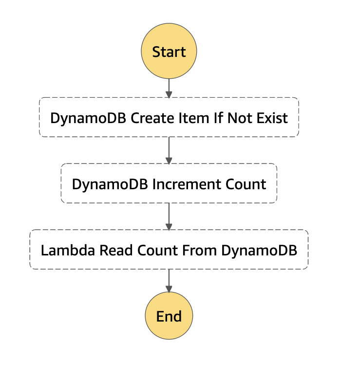
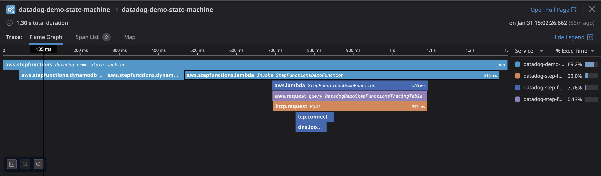

# Serverless Sample App

For more information on Datadog Serverless, check out our [Serverless Info](https://docs.datadoghq.com/serverless) page! At the time of writing, only NodeJS is supported for trace linking for Lambda generated spans and Step Functions generated spans. 

## Try out Datadog:

1. Click "Launch Stack" above.
1. Enter Datadog API Key and the Datadog Site you are registered with, acknowledge IAM Capabilities, and click `Create Stack`. See [this link](https://docs.datadoghq.com/account_management/api-app-keys/) for more info on API keys.
1. Once the stack has finished creating, open the `Outputs` tab in the stack information view.
1. Invoke the demo state machine 4-5 times by visiting the `datadog-demo-state-machine` on AWS Step Functions console.
1. Visit Datadog app, open APM / Traces page, and search for `service:datadog-demo-state-machine`.

## State Machine
### Definition

## Example Trace on Datadog APM

## Repository Structure:

This demo app is organized into four main files: `template.yaml`, `handler.js`, and `state_machine_definition.yaml`. The latter two files are injected into the template by `inject_inline_code.awk` script, which is called by `publish.sh`.
